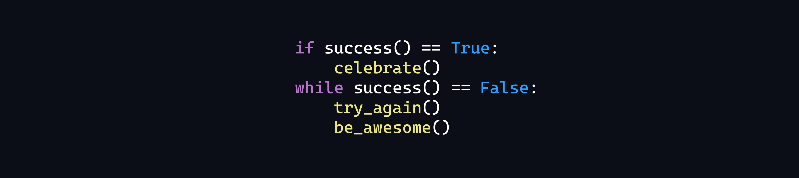

    

<h1 align="center">
  🐧 <strong>Emanuel Ferreira</strong> 
 Dev FullStack | IA Maker | Automations
</h1>

  
  

 

  

 
   
    
    
    
    
    
    

 

<h1> Soft Skills</h1>

  
    
  
  
  

 
<h1>Networks</h1>

    <a href="https://www.linkedin.com/in/emanuel0" target="_blank">
    </a>
    <a href="https://github.com/maneoDev" target="_blank">
    
</a>

